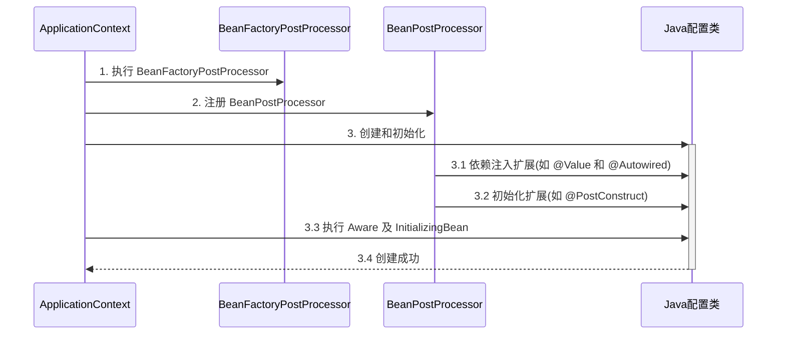

# 260915

## 1.Resource的作用

Spring对资源的抽象，方便你获取资源内部的信息，不需要手动解析。

```java
Resource resource = new ClassPathResource("application.properties");读取类路径下的文件
Resource resource =
        new FileSystemResource("D:/data/test.txt");读取绝对路径下的文件
        Resource resource =
        new UrlResource("https://example.com/test.txt");读取URL资源
```

## 2.context.refresh()的流程

1.找到所有BeanFactory‘’ 后处理器，用于补充BeanDefinition

2.添加Bean后处理器，用于添加Bean的扩展功能

3.初始化单例，可以用Bean后处理器添加扩展功能

## 3.@Autowired失效



创建单例流程：

BeanFactory 后处理器 → 注册 BeanPostProcessor → 实例化 Bean → 依赖注入 → Aware → BeanPostProcessor 前置 → 初始化方法 → BeanPostProcessor 后置

如果容器里存在 `BeanFactoryPostProcessor`，Spring 必须先把它们执行完，再开始普通单例 Bean 的初始化。

## 4.Bean初始化和销毁方法执行顺序

Spring 提供了多种初始化手段，除了课堂上讲的 @PostConstruct，@Bean(initMethod) 之外，还可以实现 InitializingBean 接口来进行初始化，如果同一个 bean 用了以上手段声明了 3 个初始化方法，那么它们的执行顺序是

1. @PostConstruct 标注的初始化方法
2. InitializingBean 接口的初始化方法
3. @Bean(initMethod) 指定的初始化方法


与初始化类似，Spring 也提供了多种销毁手段，执行顺序为

1. @PreDestroy 标注的销毁方法
2. DisposableBean 接口的销毁方法
3. @Bean(destroyMethod) 指定的销毁方法

## 5.Scope失效的解决方法

原因：（E依赖于多例F）单例对象的依赖注入只发生了一次，当E获取F时，不会创建新的F，会导致获取的都一样

解决方法就是将E依赖的这个类换成一个代理类，这样代理类只注入一次，但我们想获得目标类时，需要由代理类去创建。

## 6.除了代理实现AOP还能使用ajc

```java
<plugin>
    <groupId>org.codehaus.mojo</groupId>
    <artifactId>aspectj-maven-plugin</artifactId>
    <version>1.14.0</version>
    <configuration>
        <complianceLevel>1.8</complianceLevel>
        <source>8</source>
        <target>8</target>
        <showWeaveInfo>true</showWeaveInfo>
        <verbose>true</verbose>
        <Xlint>ignore</Xlint>
        <encoding>UTF-8</encoding>
    </configuration>
    <executions>
        <execution>
            <goals>
                <!-- use this goal to weave all your main classes -->
                <goal>compile</goal>
                <!-- use this goal to weave all your test classes -->
                <goal>test-compile</goal>
            </goals>
        </execution>
    </executions>
</plugin>
```

这个插件直接在编译器更改类源码实现代理，可以突破一些代理的限制。例如：代理没法对静态方法进行增强，但是用maven的aspectj的插件什么方法都能增强

## 7.AOP实现之agent类加载

在类加载时期实现增强

## 8.Jdk代理和cglib代理

jdk代理只能针对接口

## 9.代理类为什么需要ClassLoader

普通类先把Java源代码编译成字节码，通过类加载后使用。

代理类是没有源码的，是在运行期间直接生成字节码，类加载后才能运行。


